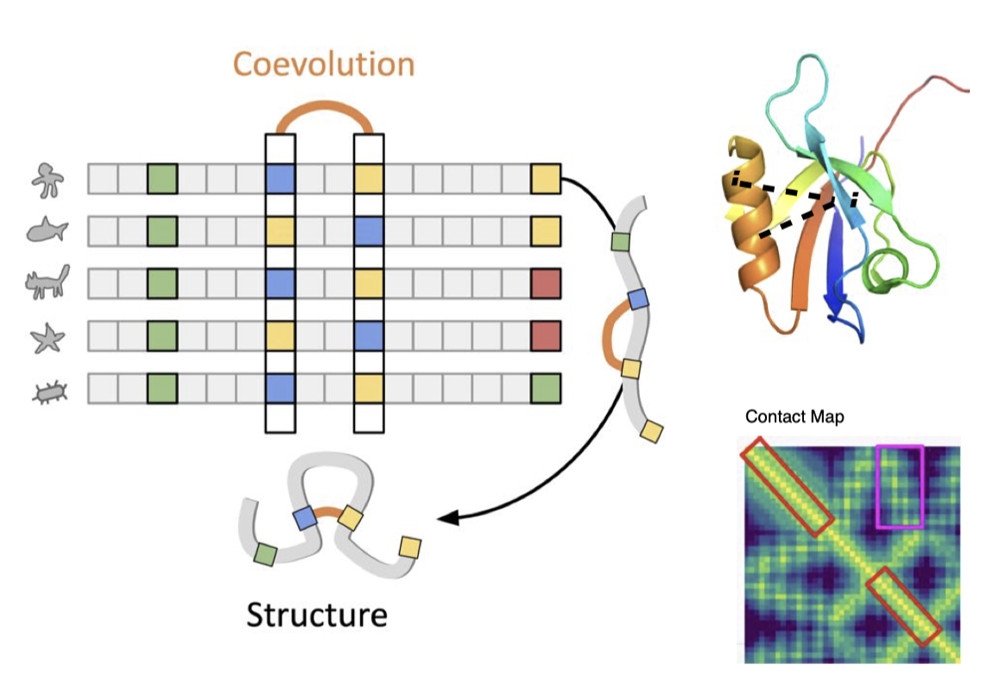
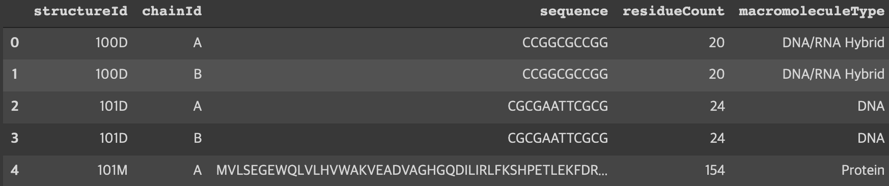
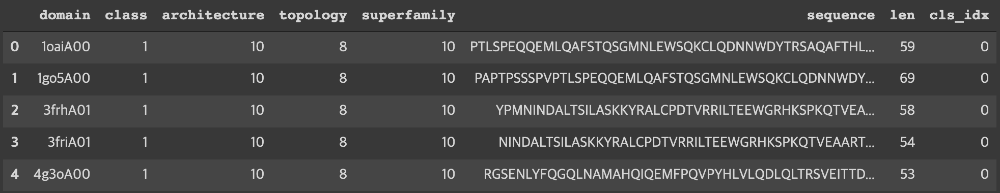
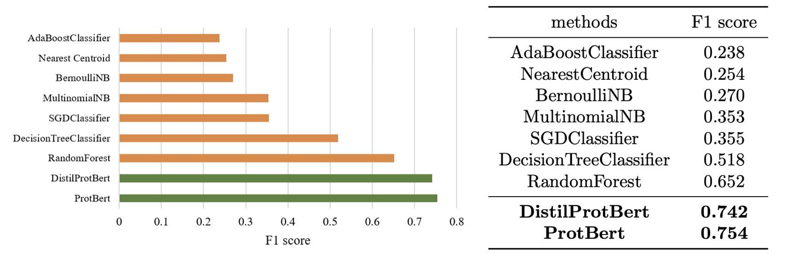

# KIAS-parallel-computing-AI
---
## Introduction
Protein Function / Structure Classification using ML/DL

Multiple Sequence Alignment

## Setting
### Dataset
- Protein Function Classification : PDB dataset

- Protein Structure Classification : CATH dataset

### Algorithm to use
- ML : Nearest Centroid, Naive Bayes(MultinomialNB, BernoulliNB), Random Forest, Decision Tree, SGD classifier
- DL : BERT based model(ProtBert), self-attention model

### Result
- F1 score for models

